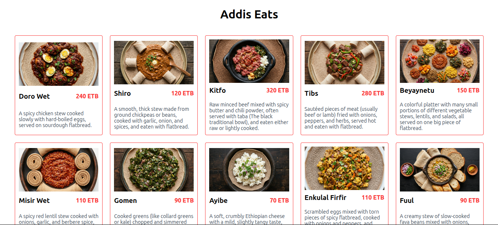

# React Day-01 Project

This is Module-03 Day-01 project. It is a React project created with vite. It consists:

- Header component - contains `<h1>` title.
- Dish component - renders menu cards
- App component - the root component that renders the page
- Separate CSS files for Header and Dish components for styling
- A data.js file contains an array of menu items

The App component loops through the menu using the `map()` method. It then passes **image**, **name**, **price**, and **description** values of each item to the Dish component as a props. The Dish component destructures the values and renders.

## Project Structure

```
src/
├── assets/
│   ├── images/
│   ├── data.js
├── components/
│   ├── Dish/
│       ├── Dish.jsx
│       ├── Dish.css
│   ├── Header/
│       ├── Header.jsx
│       ├── Header.css
├── App.jsx
├── index.css
├── main.jsx
```

## Project Preview



## How to run this project

To run this project locally:

1. Clone the repository or download the necessary files, including package.json, from GitHub
2. run: `npm install`
3. run: `npm run dev`