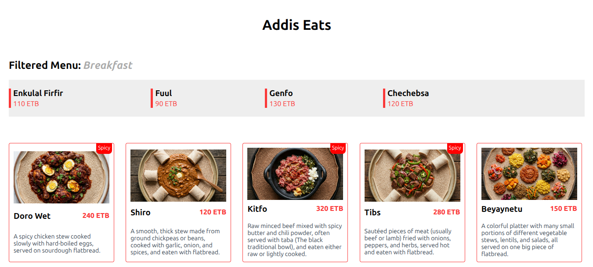

# React Day-02 Project

This is Module-03 Day-02 project. It is an updated version of Day-01 project. It consists:

- Header component - contains `<h1>` title.
- Card component - renders each card item using the `children` props.
- Dish component - renders menu cards
- Menu component - filters the dish with category
- App component - the root component that renders the page
- Separate CSS files for each component for styling
- A data.js file contains an array of menu items

## How it works

- The App component imports the `menu` array.
- It then passes the menu and category type for the Menu component.
- The Menu component filters the menu array by category and displays the match.
- If no match found, it displays "No dishes found".
- The App component also loops through the menu using the `map()` method.
- It then passes **image**, **name**, **price**, **description**, and **spicy** values of each item to the Dish component as a props.
- The Dish component destructures the values, with additional default value of **currency = "ETB"**, and renders.
- It adds a **"Spicy"** badge on the card if the dish is spicy.

## Project Structure

```
src/
├── assets/
│   ├── images/
│   ├── data.js
├── components/
│   ├── Card/
│       ├── Card.jsx
│       ├── Card.css
│   ├── Dish/
│       ├── Dish.jsx
│       ├── Dish.css
│   ├── Header/
│       ├── Header.jsx
│       ├── Header.css
│   ├── Menu/
│       ├── Menu.jsx
│       ├── Menu.css
├── App.jsx
├── index.css
├── main.jsx
```

## Project Preview



## How to run this project

To run this project locally:

1. Clone the repository or download the necessary files, including package.json, from GitHub
2. run: `npm install`
3. run: `npm run dev`